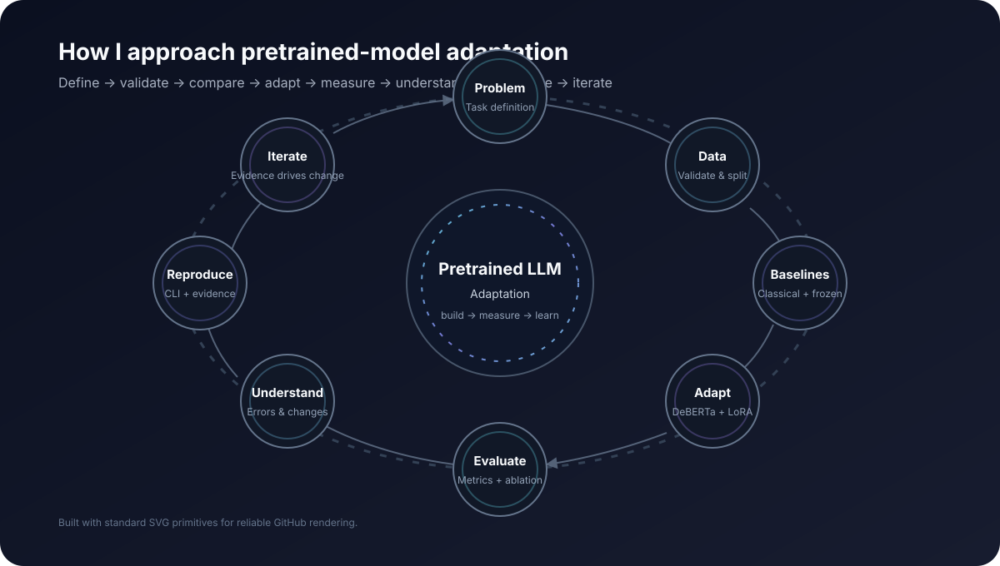

# Pretrained LLM Adaptation

A reproducible study of adapting a pretrained language model to a concrete downstream NLP task using parameter-efficient fine-tuning.

<p align="center">
  
</p>

> **Portfolio focus:** move from simply understanding pretrained language models to building, evaluating, debugging, and reproducing a complete adaptation workflow.

## What this project does

The project uses **BANKING77** intent classification as a concrete downstream task and **microsoft/deberta-v3-small** as the pretrained model.

The complete workflow is organized as:

```text
BANKING77
   ↓
Dataset validation + leakage checks
   ↓
Classical baselines
   ↓
Frozen DeBERTa
   ↓
LoRA / PEFT adaptation
   ↓
Rank ablation
   ↓
Held-out evaluation
   ↓
Error analysis + prediction comparison
   ↓
Saved adapter + inference
```

The purpose is not to produce a minimal fine-tuning example. The repository treats data preparation, model configuration, training, evaluation, failure handling, provenance, and inference as one connected engineering problem.

## Task and model

### BANKING77

The downstream task is **77-class intent classification** for banking customer-service queries.

BANKING77 contains:

- 13,083 English queries;
- 77 intent categories;
- 10,003 training examples;
- 3,080 test examples.

The dataset is acquired from a pinned upstream revision rather than committed to the repository.

### DeBERTa-v3-small

The primary pretrained model is:

```text
microsoft/deberta-v3-small
```

The model revision used by the benchmark is pinned in configuration.

The choice is deliberate: it is a real pretrained Transformer that is small enough to make controlled CPU experiments practical.

## Adaptation method

The main adaptation method is **LoRA through Hugging Face PEFT**.

The implementation explicitly configures:

```text
rank
alpha
dropout
target modules
modules to save
```

For DeBERTa, the benchmark targets:

```text
query_proj
value_proj
```

and preserves the sequence-classification components:

```text
classifier
pooler
```

Before LoRA is applied, the expected module names are verified against the instantiated model. Trainable, frozen, and total parameter counts are also recorded with each training run.

The central question is:

> How much task-specific adaptation can be obtained while updating only a small fraction of the pretrained model?

## Baseline ladder

The project does not treat LoRA as a black box. Several baselines separate lexical performance, pretrained representations, and encoder adaptation.

| ID | Method | Purpose |
|---|---|---|
| B0 | Majority class | Evaluation floor and pipeline sanity check |
| B1 | TF-IDF + Logistic Regression | Classical non-Transformer reference |
| B2 | Frozen DeBERTa | Measures pretrained representations without encoder adaptation |
| A1 | LoRA | Primary parameter-efficient adaptation experiment |
| A2 | Full fine-tuning | Conditional comparison when compute permits a controlled run |

Full fine-tuning is intentionally conditional. The project does not manufacture a comparison that the available hardware cannot support responsibly.

## Data engineering and leakage control

The data pipeline does more than load CSV files.

Before training, it validates:

- expected schema;
- the complete 77-intent label set;
- empty or malformed samples;
- duplicate training texts;
- train/test text overlap;
- deterministic stratified train/validation splitting;
- leakage between the resulting fit and validation sets.

Text comparisons are normalized using stripping and case folding.

When exact normalized text appears in both the official training and test files, that text is excluded from the training pool before the validation split. The preparation step records the resulting counts and audit information in a manifest.

The public test set remains held out for final evaluation and is never used for LoRA rank selection.

## Experiment design

The benchmark is deliberately **resource-bounded** so the complete pipeline can run on GitHub-hosted CPU runners.

The current benchmark protocol is:

| Stage | Training data | Validation data | Epochs | Max length |
|---|---:|---:|---:|---:|
| Frozen DeBERTa | 600 | 200 | 2 | 48 |
| LoRA rank 4 | 3,000 | 1,000 | 1 | 48 |
| LoRA rank 8 | 3,000 | 1,000 | 1 | 48 |
| LoRA rank 16 | 3,000 | 1,000 | 1 | 48 |
| Final LoRA | 1,200 | 300 | 3 | 48 |
| Final evaluation | — | — | — | Full 3,080-example test split |

Common benchmark settings include:

- learning rate: `5e-5`;
- AdamW;
- weight decay: `0.01`;
- warmup ratio: `0.1`;
- gradient clipping: `1.0`;
- sequence length: 48;
- random seed: 42;
- CPU training with fp16/bf16 disabled.

The LoRA rank is selected using **validation macro F1**. The selected rank is then retrained using the larger final allocation and evaluated once on the held-out test set.

This is an engineering benchmark under constrained compute, not a full-data or state-of-the-art study.

## Evaluation

The evaluation layer reports:

- accuracy;
- macro F1;
- weighted F1;
- per-class precision, recall, and F1;
- confusion matrix;
- prediction distribution.

Training metadata can additionally capture:

- total parameters;
- trainable parameters;
- trainable-parameter percentage;
- training runtime;
- environment/package versions.

The evaluation code checks for non-finite logits and probabilities.

It also contains a **degenerate-output guard**: a final benchmark evaluation is rejected when the classifier predicts only one unique intent. Diagnostic frozen/ablation runs can explicitly allow such output so that failure can still be inspected without promoting it to final evidence.

## Error analysis

The final prediction artifact can be analyzed for:

- error rate;
- errors by gold intent;
- errors by input-length bucket;
- most frequent gold/predicted confusion pairs;
- high-confidence errors.

A separate prediction-comparison step checks that two artifacts are aligned and records examples whose predictions changed.

This makes it possible to inspect not only whether performance changed, but **where and how the model's behavior changed**.

## Reproducible inference

The repository includes a small command-line inference surface.

The installed package exposes:

```bash
llm-adapt
```

For a saved LoRA adapter:

```bash
llm-adapt predict \
  --model-dir artifacts/runs/selected-r<rank>-final \
  --text "How long will my card take to arrive?"
```

The prediction output includes the selected intent, confidence, model name, model revision, and adapter path.

The benchmark also runs an inference smoke test after producing the final adapter artifact.

## Project structure

```text
Pretrained-LLM-Adaptation/
├── src/pretrained_llm_adaptation/
│   ├── baselines.py
│   ├── cli.py
│   ├── config.py
│   ├── data.py
│   ├── evaluation.py
│   ├── inference.py
│   ├── lora.py
│   ├── modeling.py
│   ├── seed.py
│   └── training.py
│
├── configs/
│   ├── baseline.yaml
│   ├── lora.yaml
│   ├── ci-*.yaml
│   ├── ablation-*.yaml
│   └── smoke.yaml
│
├── scripts/
│   ├── download_data.py
│   ├── prepare_data.py
│   ├── inspect_model.py
│   ├── run_baselines.py
│   ├── train_frozen.py
│   ├── train_lora.py
│   ├── select_rank.py
│   ├── evaluate_model.py
│   ├── analyze_errors.py
│   ├── compare_predictions.py
│   ├── compile_results.py
│   └── write_benchmark_report.py
│
├── tests/
├── docs/
├── experiments/
├── artifacts/
└── assets/
```

The module boundaries are intentionally narrow:

- `data.py` — acquisition, validation, leakage checks, splitting;
- `baselines.py` — majority and TF-IDF baselines;
- `modeling.py` — pretrained model/tokenizer loading and architecture inspection;
- `lora.py` — PEFT configuration and parameter accounting;
- `training.py` — frozen-encoder and LoRA training;
- `evaluation.py` — classification metrics and serializable reports;
- `inference.py` — base-model plus adapter loading and prediction.

## Reproducibility and provenance

Experiments are configuration-driven.

Run metadata records the information needed to trace a training run, including:

- experiment name and method;
- model identifier and revision;
- dataset revision;
- complete configuration;
- train/validation sample counts;
- parameter statistics;
- training metrics;
- Python/platform information;
- installed ML package versions.

Raw datasets, downloaded model weights, and generated run directories are intentionally kept out of normal source control.

## Tests and continuous integration

The repository has three distinct verification layers.

### Quality CI

GitHub Actions runs:

```text
Ruff lint
Ruff format check
mypy
pytest
CLI smoke test
```

### ML smoke test

A lightweight end-to-end workflow prepares a fixture dataset, trains a tiny LoRA model, and verifies that an adapter artifact is produced.

This keeps the ML path exercised without requiring the full BANKING77 benchmark on every quality check.

### Portfolio benchmark

The Benchmark workflow performs:

```text
prepare
   ↓
classical baselines
   ↓
frozen baseline
   ↓
LoRA r=4 / r=8 / r=16
   ↓
validation rank selection
   ↓
final LoRA training
   ↓
full test evaluation
   ↓
error analysis
   ↓
prediction comparison
   ↓
result compilation
   ↓
benchmark report
   ↓
integrity verification
   ↓
inference smoke test
   ↓
published evidence
```

Benchmark publication is gated by consistency checks on the selected rank, final prediction count, prediction diversity, metric ranges, required baseline rows, and saved adapter/tokenizer artifacts.

## Run locally

Create a Python 3.12 environment and install the project:

```bash
python -m pip install -e ".[dev]"
```

Prepare the pinned BANKING77 source data:

```bash
python scripts/download_data.py --config configs/lora.yaml
python scripts/prepare_data.py --config configs/lora.yaml
```

Inspect the actual model modules:

```bash
python scripts/inspect_model.py --config configs/lora.yaml
```

Run the classical baselines:

```bash
python scripts/run_baselines.py --config configs/baseline.yaml
```

Run the frozen representation baseline:

```bash
python scripts/train_frozen.py --config configs/lora.yaml
```

Run a LoRA experiment:

```bash
python scripts/train_lora.py --config configs/lora.yaml
```

Run the rank ablation:

```bash
bash scripts/run_rank_ablation.sh
```

Evaluate a saved adapter:

```bash
python scripts/evaluate_model.py \
  --model-dir artifacts/runs/lora-r8 \
  --adapter
```

Run error analysis:

```bash
python scripts/analyze_errors.py experiments/model-evaluation.json
```

Run tests:

```bash
pytest
```

Run static checks:

```bash
ruff check src tests scripts
ruff format --check src tests scripts
mypy src
```

## What is intentionally out of scope

This repository stays focused on **pretrained-model adaptation**.

The core project does not add RAG, agents, LangChain/LangGraph, vector databases, frontend/UI, SaaS, Kubernetes, distributed training, or multi-model orchestration simply to expand the technology list.

QLoRA and full fine-tuning are also not mandatory parts of the benchmark. They are included only when they answer a meaningful experimental question under the available compute constraints.

## Evidence standard

The project explicitly separates **implementation** from **measurement**.

A planned experiment is not a result.

A metric is treated as verified only when:

1. the producing workflow step completes successfully;
2. the generated artifact exists;
3. model, data, and configuration provenance are recorded;
4. the public test set was not used for model selection.

The repository does not replace missing measurements with numbers copied from external projects and does not make state-of-the-art, production-ready, scalable, robust, or enterprise-grade claims that have not been demonstrated here.

## Current status

**Engineering implementation complete — final empirical verification in progress.**

The source package, data pipeline, baselines, LoRA adaptation path, evaluation safeguards, inference CLI, tests, CI, methodology documentation, and benchmark publication workflow are implemented.

The release benchmark is triggered from the current `main` commit. No final performance claim is made until that run completes its integrity checks and publishes the resulting evidence.

## Limitations

This project studies one English, single-domain intent-classification problem with a relatively small dataset and an encoder-style pretrained model.

The benchmark uses constrained training subsets for reproducibility and CPU feasibility. Consequently, its results should be interpreted as evidence about the **adaptation pipeline under the stated protocol**, not as the best achievable BANKING77 performance.

The conclusions also do not automatically generalize to multilingual, multi-domain, generative, or large-scale language-model adaptation.

## References

- BANKING77 dataset: https://huggingface.co/datasets/PolyAI/banking77
- DeBERTa-v3-small: https://huggingface.co/microsoft/deberta-v3-small
- Transformers PEFT: https://huggingface.co/docs/transformers/peft
- PEFT LoRA: https://huggingface.co/docs/peft/main/package_reference/lora
- PEFT troubleshooting: https://huggingface.co/docs/peft/main/developer_guides/troubleshooting
- Original BANKING77 repository: https://github.com/PolyAI-LDN/task-specific-datasets

## License

MIT
